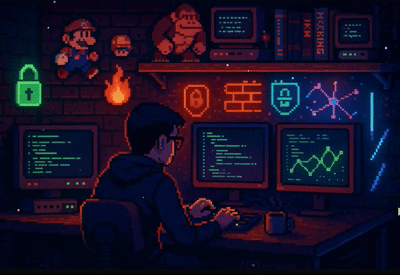

<!-- Banner -->

  

<!-- Profile Image -->

  

<!-- Typing Animation -->

  

---

<h1 align="center">🚀 Backend Engineer | 🔐 Cybersecurity | 🛠️ Problem Solver</h1>

  

---

## 👨‍💻 About Me
- 🎓 **B.Tech in Cyber Security** at Dr. A. P. J. Abdul Kalam Technical University
- 💡 Passionate about **Backend Engineering, Distributed Systems, Cloud & DevOps**
- 🧠 Solved **300+ LeetCode** problems
- 🎙️ Speaker at **AWS UG Kanpur** & **FOSS United Kanpur** (350+ audience)
- 🏆 **SuperHack 2025 Grand Finale Qualifier** | **HackWithUP Finalist 2025**
- 🧩 Building scalable real-world backend systems & secure architectures

---

## ⚡ Skills & Tools

  

  
  
  
  

---

## 🌟 **NEXT-GEN PROJECT SHOWCASE (Custom Interface)**
### *A unique premium interface — not the default GitHub pinned section.*

  

<table align="center" width="100%">

<!-- Project 1 -->
<tr>
<td width="100%">
  
    
  
   
  🧠 **Enterprise-grade MSP automation engine** with microservices, async execution & AWS-ready infra.
    
</td>
</tr>

<!-- Project 2 -->
<tr>
<td width="100%">
  
    
  
   
  🎥 **High-speed CV pipeline** with YOLOv8 and multi-object tracking at real-time FPS.
    
</td>
</tr>

<!-- Project 3 -->
<tr>
<td width="100%">
  
    
  
   
  🔊 **Emotion-driven music recommendations** powered by CNN & facial sentiment detection.
    
</td>
</tr>

<!-- Project 4 -->
<tr>
<td width="100%">
  
    
  
   
  🛡️ **Dynamic sandbox environment** for malware behavior, signature extraction & threat mapping.
    
</td>
</tr>
</table>

  

---

## 🏆 Achievements
- 🥇 **SuperHack 2025 Grand Finale Qualifier**
- 🥈 **HackWithUP Finalist (2025)**
- 🎙️ **AWS UG Kanpur Speaker** – IAM, AWS Foundations
- 🎙️ **FOSS United Speaker** – Bash Workshop (350+ attendees)
- 🧠 **300+ LeetCode problems solved**
- 📜 **AWS Cloud Practitioner Certified (2024)**
- 🤝 Contributor at **FOSS United** & **AWS User Group Kanpur**

---

## 📊 GitHub Stats & Streaks

  
  

  

  

---

## 🌐 Connect With Me

  
  <a href="https://www.linkedin.com/in/kr
